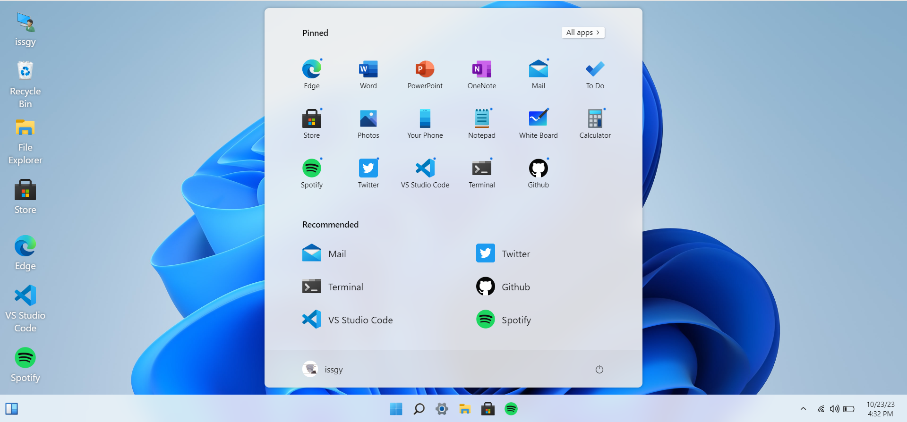
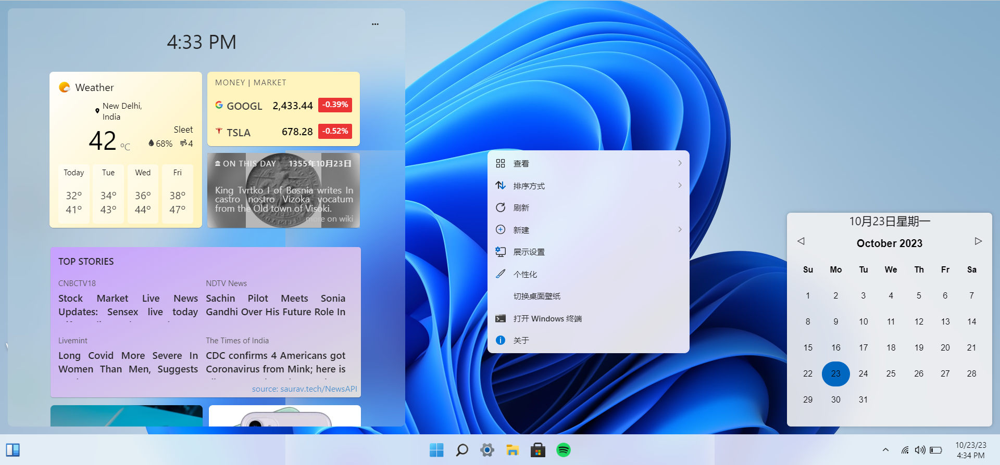
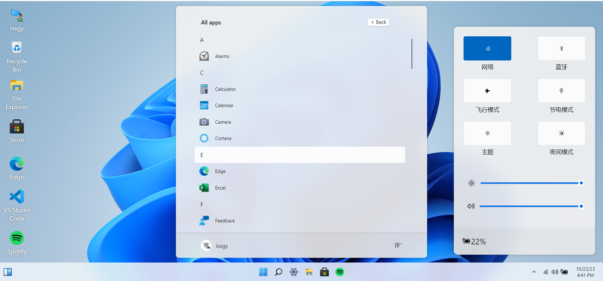
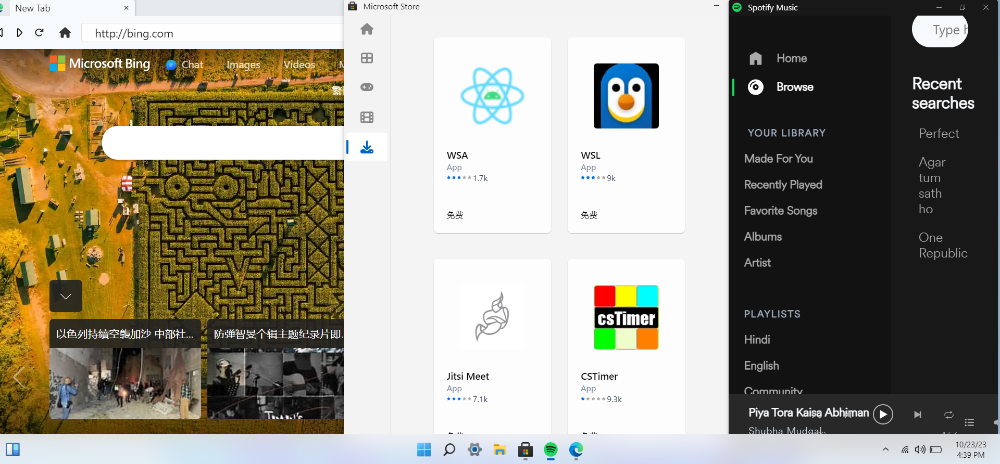

# Win11React

[win11React](https://github.com/issgy/win11React) 使用 React、CSS 和 JavaScript 等标准 Web 技术在 Web 上复制 Windows 11 的桌面体验

#### 现场体验 🌈: [win11.iamdt.eu.org](https://win11.iamdt.eu.org)

# 展示

# 特性

- [x] 开始菜单、搜索菜单和小部件
- [x] 桌面和右键单击操作
- [x] 侧边导航和日历视图
- [x] 不同布局中的贴靠窗口
- [x] 浏览器， 商店， 终端， 计算器
- [x] 记事本、Vscode、白板
- [x] 文件资源管理器 + 设置
- [x] 拖动窗口和调整窗口大小
- [x] 启动和锁定屏幕
- [x] 主题和背景

# 运行命令

#### `yarn start`

打开 http://localhost:3000 端口即可

#### 许可证

⚖️ CC0-1.0 License
